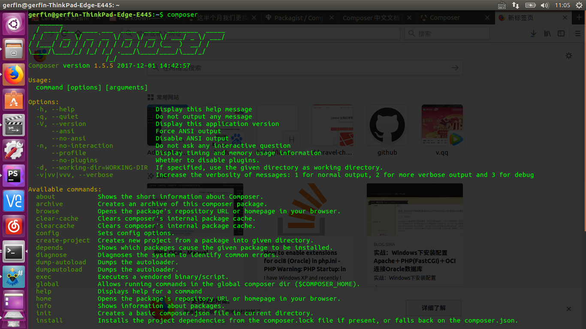
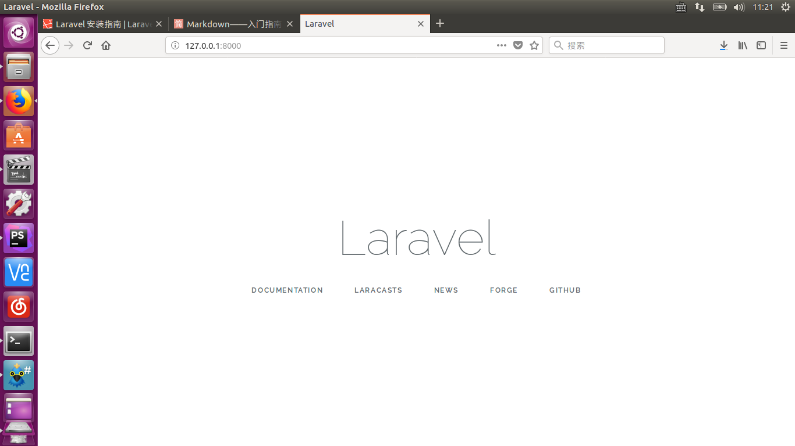

# 总体架构
> - 前台
> 	- 文章模块
> 	- 用户模块
> 	- 评论模块
> 	- 赞模块
> 	- 搜索模块
> 	- 个人中心模块
> - 后台
> 	- 后台架构
> 	- 管理人员模块
> 	- 审核模块
> 	- 权限模块
> 	- 专题管理
> 	- 系统通知模块

## laravel5.5的安装与启动

### composer的安装
- 自动安装：https://getcomposer.org/download/提供了自动安装的方法
- 手动安装：
- 在上述网站中的Manual Download列表下载最新的composer.phar的文件
 - linux系统：将该文件拷贝到/usr/bin/composer文件夹下（cp composer.phar /usr/bin/composer），然后赋予执行权限（chmod +x /usr/bin/composer），运行composer即可显示
 - windows系统：找到php目录，将composer.phar放在php根目录下，同时新建bat文件，文件内容为： <code>@ECHO OFF
 php "%~dp0composer.phar" %*</code> 
 运行dos下运行composer即可
使用中国镜像服务器:<code>composer config -g repo.packagist composer https://packagist.phpcomposer.com</code>
- composer运行成功界面

---

### laravel5.5的安装

- 在站点目录下运行composer命令：<code>composer create-project --prefer-dist laravel/laravel laravel55 </code>，其中最后关键字laravel55即为laravel安装的程序目录，相关安装文档见[laravel中文安装文档](https://d.laravel-china.org/docs/5.4/installation)
- 推荐使用[phpstorm](https://www.jetbrains.com/zh/phpstorm/)进行代码编辑
- 启动laravel:使用laravel自带的artisan命令即可启动php站点,进入上一步创建的laravel程序目录laravel55，运行artisan命令（在laravel下启动终端）：php artisan serve,站点即启动，访问http://127.0.0.1:8000 即可看到laravel的站点
- laravel目录结构介绍见[laravel中文-Laravel 的文件夹结构](https://d.laravel-china.org/docs/5.4/structure)
- 配置文件的修改
	- 配置文件位于laravel55/.env,如果没有，将laravel55/.env.example改成.env
	- 根据自己的数据库相关情况配置，例如我的将laravel用到的数据放在homestead数据库中，我的配置如下
DB_CONNECTION=mysql
DB_HOST=127.0.0.1
DB_PORT=3306
DB_DATABASE=homestead
DB_USERNAME=[mysql的用户名]
DB_PASSWORD=[mysql的密码]
<i>在向github更新版本时，不要将.env更新上去，里面包含你的相关配置信息</i>
---
## 文章模块的设计
### 文章模块架构
> - 路由
> 	- 路由
> 	- 模板
> - 表设计
> 	- 表设计
> 	- 模型
> - 页面逻辑
> 	- 文章列表
> 	- 添加文章
> 	- 编辑文章
> 	- 删除文章
> 	- 文章详情

<i>用phpstorm打开该项目文件夹(laravel55)</i>
### 路由
路由的相关文档见[laravel中文文档-Laravel HTTP 路由功能](https://d.laravel-china.org/docs/5.4/routing)
<i>此项目的路由配置表位于laravel55/routes/web.php</i>
#### 文章路由结构
> - 文章列表
> - 添加文章
> - 编辑文章
> - 删除文章
> - 文章详情

#### 文章模块的具体设计
- 新建文章列表页路由并指向PostController下的index方法，具体为在web.php写下如下代码:

```php
//文章列表页
Route::get('/posts','\App\Http\Controllers\PostController@index');
//文章详情页
Route::get('/posts/create','\App\Http\Controllers\PostController@create');
Route::get('/posts/{post}','\App\Http\Controllers\PostController@show');
//创建文章
Route::post('/posts','\App\Http\Controllers\PostController@store');
//编辑文章
Route::get('/posts/{post}/edit','\App\Http\Controllers\PostController@edit');
Route::put('/posts/{post}','\App\Http\Controllers\PostController@update');
//删除文章
Route::get('/posts/{post}/delete','\App\Http\Controllers\PostController@delete');
```

- 在app/Http/Controller下创建PostController控制器，可直接使用artisan命令：<code>php artisan make:controller PostController</code>
- 在PostController添加路由中指定的function，具体代码如下：

```php
<?php
namespace App\Http\Controllers;
use Illuminate\Http\Request;
class PostController extends Controller
{
    //列表
    public function index()
    {

    }

    //文章详情页面
    public function show()
    {

    }

    //创建文章页面
    public function create()
    {

    }

    //创建文章逻辑
    public function store()
    {

    }

    //编辑文章页面
    public function edit()
    {

    }

    //编辑文章逻辑
    public function update()
    {

    }

    //删除文章逻辑
    public function delete()
    {

    }
}
```

- blade模板渲染文章页面
> <b>需要渲染的文章页面</b>
> - 创建文章页面
> - 编辑文章页面
> - 文章列表页面
> - 文章详情页面

	- 文章渲染需要使用view函数，在文章列表页中的具体实现为：
	```php
    //列表
    public function index()
    {
        return view("post/index");
    }
    ```
    <i>return的view函数是在app/resources/views下去找模板，如view("post/index")是在post文件夹下找index.blade.php,对于页面渲染的相关文档，参照[laravel中文文档-Laravel 的视图功能](https://d.laravel-china.org/docs/5.4/views)</i>
    - 在app/resources/views/下新建post文件夹,在post文件夹下，新建index.blade.php,将html的内容复制进去，该文件位于[课程材料/前台/文章列表.html](课程材料/前台/文章列表.html),将[课程材料/前台/](课程材料/前台/)下的css,front,js,image文件夹拷贝到项目中app/public文件夹下，将刚才的index.blade.php中所有的相对路径修改为绝对路径(目的是为了正确引用public文件夹下的js，css文件)，如(注意href后的变化)：
    ```php
    <link href="css/blog.css" rel="stylesheet">
    <link rel="stylesheet" type="text/css" href="css/wangEditor.min.css">
    ```
    修改为=>
    ```php
        <link href="/css/blog.css" rel="stylesheet">
        <link rel="stylesheet" type="text/css" href="</css/wangEditor.min.css">
    ```

